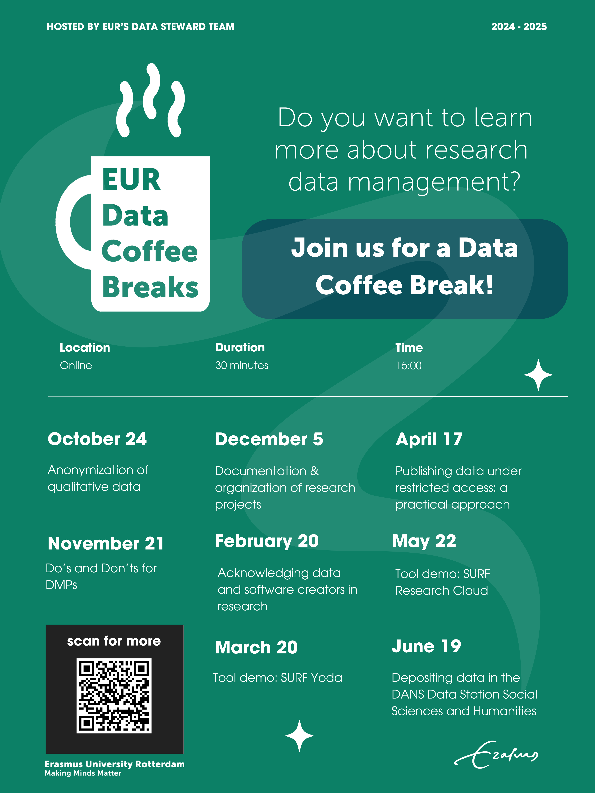

# EUR Data Coffee Breaks

The EUR Data Coffee Breaks are short, focused, and informal presentations around Research Data Management (RDM). Each month is dedicated to a different RDM topic, and EUR researchers can join the online sessions (via [this Teams link](https://teams.microsoft.com/l/meetup-join/19%3ameeting_ODg5N2ZlNzMtNmY5Yi00NmEzLWJmZDktOTkwYTI2ZGRjZDA0%40thread.v2/0?context=%7b%22Tid%22%3a%22715902d6-f63e-4b8d-929b-4bb170bad492%22%2c%22Oid%22%3a%229fce85bf-ab82-4f9c-9912-c8da2849fab6%22%7d)) that take place on Thursday at 3pm. The presentations start with a 10–15-minute presentation, followed by 15 minutes for questions and discussion. These short presentations are of course nothing more than starting points, but we are happy to organize in-depth support and training when needed. The sessions are not recorded, but slides will be published after the session.  
 
### What topics will be covered?

Most themes are presented by the Research Data Stewards, but we welcome guests to present more specialized topics. Do you have suggestions for a topic or a speaker? Please get in touch by email via datasteward at eur.nl  

In 2022, the Data Coffee Breaks were first organized at the Erasmus School of Social and Behavioural Sciences as [ESSB Data Coffee Breaks](https://my.eur.nl/en/essb-employee/research-support/research-data-management). For some of the topics covered see the presentations in the [EUR Research Data Stewardship community](https://zenodo.org/communities/eur_research_data_stewardship/) on Zenodo (in the schedule below you can find links to some of those presentations under **Materials**).  

### Join the mailing list to receive updates
Go to [this page](https://sympa.eur.nl/sympa/info/data-coffee-breaks) to subscribe to the mailing list to receive updates and calendar invites for the EUR Data Coffee Breaks (note that you need to connect to the EUR network, for example using eduVPN, to access the mailing list page).

## Coffee Break Schedule 2024-2025

| Topic | Date | Location | Materials |
| --- | --- | --- | --- |
| Anonymization of qualitative data  | Thurs 24 Oct 15:00| [Online](https://teams.microsoft.com/l/meetup-join/19%3ameeting_YjRjMzU4Y2YtNjI0NS00YjQ4LTkxNjgtOGZlOWE3YjE1YmVi%40thread.v2/0?context=%7b%22Tid%22%3a%22715902d6-f63e-4b8d-929b-4bb170bad492%22%2c%22Oid%22%3a%225e484f9b-bf7b-41a4-9a0d-2e246301295b%22%7d) |  |
| Do’s and Don’ts for data management plans  | Thurs 21 Nov 15:00| [Online](https://teams.microsoft.com/l/meetup-join/19%3ameeting_NTNiMDgwZjMtODk4Yi00ODI4LTk5MTItYWZjNjFjNjIyY2Nh%40thread.v2/0?context=%7b%22Tid%22%3a%22715902d6-f63e-4b8d-929b-4bb170bad492%22%2c%22Oid%22%3a%225e484f9b-bf7b-41a4-9a0d-2e246301295b%22%7d) |  |
| Best practices for documenting and organizing research projects  | Thurs 5 Dec 15:00| [Online](https://teams.microsoft.com/l/meetup-join/19%3ameeting_NDI0YzViNzktOTEyYi00OWEwLWI3ODItOTliMzQwZjIwZjEw%40thread.v2/0?context=%7b%22Tid%22%3a%22715902d6-f63e-4b8d-929b-4bb170bad492%22%2c%22Oid%22%3a%225e484f9b-bf7b-41a4-9a0d-2e246301295b%22%7d) |  |
| Where credit is due: research data and software creators | Thurs 20 Feb 15:00| [Online](https://teams.microsoft.com/l/meetup-join/19%3ameeting_ODg5N2ZlNzMtNmY5Yi00NmEzLWJmZDktOTkwYTI2ZGRjZDA0%40thread.v2/0?context=%7b%22Tid%22%3a%22715902d6-f63e-4b8d-929b-4bb170bad492%22%2c%22Oid%22%3a%229fce85bf-ab82-4f9c-9912-c8da2849fab6%22%7d) |  |
| Tool demo: SURF Yoda  | Thurs 20 Mar 15:00| [Online](https://teams.microsoft.com/l/meetup-join/19%3ameeting_ODg5N2ZlNzMtNmY5Yi00NmEzLWJmZDktOTkwYTI2ZGRjZDA0%40thread.v2/0?context=%7b%22Tid%22%3a%22715902d6-f63e-4b8d-929b-4bb170bad492%22%2c%22Oid%22%3a%229fce85bf-ab82-4f9c-9912-c8da2849fab6%22%7d) |  |
| Publishing data under restricted access: a practical approach  | Thurs 17 Apr 15:00| [Online](https://teams.microsoft.com/l/meetup-join/19%3ameeting_ODg5N2ZlNzMtNmY5Yi00NmEzLWJmZDktOTkwYTI2ZGRjZDA0%40thread.v2/0?context=%7b%22Tid%22%3a%22715902d6-f63e-4b8d-929b-4bb170bad492%22%2c%22Oid%22%3a%229fce85bf-ab82-4f9c-9912-c8da2849fab6%22%7d) |  |
| Tool demo: SURF Research Cloud  | Thurs 22 May 15:00| [Online](https://teams.microsoft.com/l/meetup-join/19%3ameeting_ODg5N2ZlNzMtNmY5Yi00NmEzLWJmZDktOTkwYTI2ZGRjZDA0%40thread.v2/0?context=%7b%22Tid%22%3a%22715902d6-f63e-4b8d-929b-4bb170bad492%22%2c%22Oid%22%3a%229fce85bf-ab82-4f9c-9912-c8da2849fab6%22%7d) |  |
| Depositing data in the DANS Data Station Social Sciences and Humanities  | Thurs 19 Jun 15:00| [Online](https://teams.microsoft.com/l/meetup-join/19%3ameeting_ODg5N2ZlNzMtNmY5Yi00NmEzLWJmZDktOTkwYTI2ZGRjZDA0%40thread.v2/0?context=%7b%22Tid%22%3a%22715902d6-f63e-4b8d-929b-4bb170bad492%22%2c%22Oid%22%3a%229fce85bf-ab82-4f9c-9912-c8da2849fab6%22%7d) |  |

### Previous topics & materials

| Topic | Date | Materials |
| --- | --- | --- |
| Best practices for documenting and organizing research projects | Jan 2023 |  |
| Anonymization of qualitative data | Feb 2023 |  |
| Persistent identifiers | Mar 2023 |  |
| Making understandable codebooks using SPSS and R | Apr 2023 |  |
| Licenses for research data | May 2023 |  |
| Tool Demo: iRODS/Yoda  | Jun 2023 |  |
| Introduction to the FAIR principles / [FAIR Aware tool](https://fair-aware.eur.nl/) | Sep 2023 |  |
| How to prepare a publication package? | Oct 2023 |  |
| Privacy by design | Nov 2023|  |
| Sharing qualitative data | Dec 2023 |  |
| Do’s and Don’ts for data management plans | Jan 2024 |  |
| In order: Intro to versioning (and git) | Feb 2024|  |
| How to choose a repository? | Mar 2024|  |
| Anonymization of quantitative data | Apr 2024|  |
| Metadata – what, why and how? | May 2024|  |
| Legal arrangements for RDM | Jun 2024|  |

### Further reading

If you are interested in reading more about research data management, we have a few suggestions:  
- More information about Research Data Management at Erasmus University Rotterdam can be found [here](https://www.eur.nl/en/research/research-services/research-data-management)  
- We also organize other workshops and courses, see the [RDM workshops page](https://www.eur.nl/en/research/research-services/research-data-management/rdm-workshops) page for an overview  
- [23 things for research data management](https://23things.sites.uu.nl/) is a great tool full of links to data management resources, developed by the [National Coordination Point Research Data Management (LCRDM, the Netherlands)](https://www.lcrdm.nl/)

### Zenodo  
All presentation used during the EUR Data Coffee Breaks are published Open Access on [Zenodo](https://zenodo.org/communities/eur_research_data_stewardship/). EUR Data Stewards welcome contributions related to research data management, and those can be uploaded to the [EUR Research Data Stewardship community](https://zenodo.org/communities/eur_research_data_stewardship/).  

### Contact 
For any questions about the EUR Data Coffee Breaks or about Research Data Management, please contact the Research Data Stewards at EUR by email via datasteward at eur.nl
